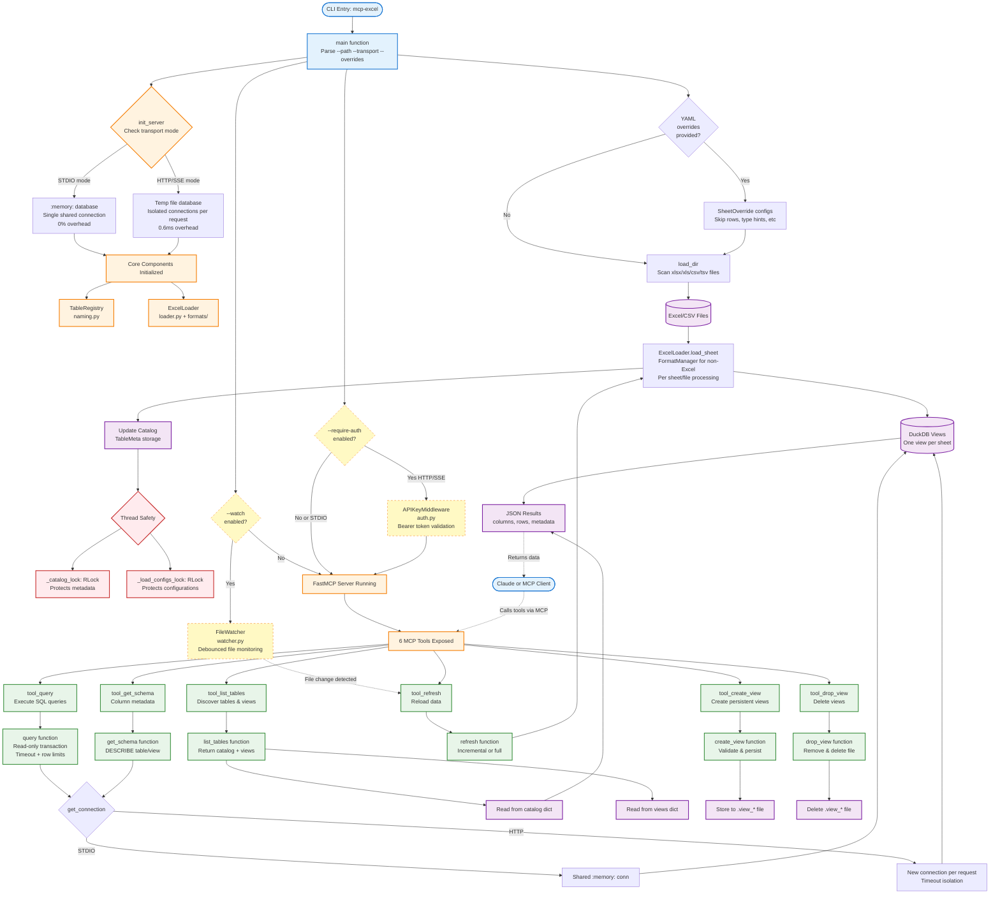

# Development Guide

Technical documentation for developers, DevOps, and system administrators deploying or contributing to mcp-server-excel-sql.

## Who Should Read This

**Architecture & Design Decisions:** Developers contributing code
**Security & Deployment:** DevOps/SysAdmins deploying the server
**Development Workflow:** Contributors setting up local environment
**Troubleshooting:** Anyone debugging issues
**Reference:** Performance data and test structure

## Architecture

### Overview

The server provides SQL access to Excel and CSV files through two modes:
- **STDIO mode**: Single-threaded, in-memory, for local use (Claude Desktop)
- **HTTP/SSE mode**: Multi-threaded, persistent file, for concurrent users

Supported formats: xlsx, xlsm, xls, csv, tsv

Key design philosophy: Simplicity and isolation over performance optimization.

**Architecture Diagram:**



**Diagram Legend:**
- **Blue (Entry points)**: CLI entry and client interactions
- **Orange (Core components)**: Main server components and initialization
- **Purple (Storage)**: Data storage and retrieval
- **Green (Tools)**: MCP tools and their functions
- **Yellow (Optional)**: Optional features (watch mode, authentication)
- **Red (Safety)**: Thread safety mechanisms
- **Dashed lines**: Asynchronous or conditional flows

### Transport Modes

#### STDIO Mode (Default)

Single shared in-memory DuckDB connection for single-threaded usage.

**Characteristics:**
- Connection: `:memory:`
- Concurrency: Single-threaded
- Overhead: 0% (no locking needed)
- Use case: Claude Desktop, local CLI usage

**Connection strategy:**
```python
conn = duckdb.connect(":memory:")  # Single shared connection
loader = ExcelLoader(conn, registry)
```

#### HTTP/SSE Mode

Persistent DuckDB file with isolated connections per request for concurrent access.

**Characteristics:**
- Connection: Temp file (auto-cleanup on shutdown)
- Concurrency: Isolated connection per request
- Overhead: ~0.6ms per request (connection creation + lock acquisition)
- Use case: Multiple concurrent users, web APIs
- Capacity: ~10-20 concurrent users

**Connection strategy:**
```python
@contextlib.contextmanager
def get_connection():
    local_conn = duckdb.connect(_db_path)  # New connection per request
    try:
        yield local_conn
    finally:
        local_conn.close()
```

### Structure Analyzer

**Component**: `mcp_excel/structure_analyzer.py` (461 lines)

**Purpose**: Automatic detection of Excel file structure for handling messy, real-world files without manual configuration.

#### What It Detects

The `ExcelAnalyzer` class provides automatic analysis of:

1. **Merged cells**: Detects merged ranges and their boundaries
2. **Hidden rows/columns**: Identifies rows/columns marked as hidden
3. **Data regions**: Locates actual data start/end (row/col)
4. **Header rows**: Detects header rows with confidence scoring
5. **Metadata rows**: Finds title rows and notes before data
6. **Number locales**: Auto-detects European (1.234,56) vs US (1,234.56) formats
7. **Multiple tables**: Discovers multiple tables on a single sheet (separated by 2+ blank rows)
8. **Blank row patterns**: Maps blank row locations for table separation

#### When Used

Only activated when `auto_detect: true` in YAML configuration. Optional feature.

**Workflow**:
```python
# In loader.py
if override and override.auto_detect and file.suffix.lower() in ['.xlsx', '.xlsm']:
    analyzer = ExcelAnalyzer()
    structure_info = analyzer.analyze_structure(file, sheet)

    # Merge auto-detected info with user overrides
    effective_override = self._merge_override_with_detection(override, structure_info)
```

#### Caching Strategy

**Cache key**: `file_path:sheet_name:mtime`

**Benefits**:
- Avoid re-analyzing unchanged files
- Fast reloads on file watch/refresh
- Minimal memory footprint (metadata only)

**Invalidation**: Automatic on file modification (mtime change)

**Implementation**:
```python
def analyze_structure(self, file_path: Path, sheet: str) -> StructureInfo:
    mtime = file_path.stat().st_mtime
    cache_key = f"{file_path}:{sheet}:{mtime}"

    if cache_key in self._cache:
        return self._cache[cache_key]

    # Perform analysis...
    structure_info = StructureInfo(...)
    self._cache[cache_key] = structure_info
    return structure_info
```

#### Multi-Table Detection Algorithm

**Goal**: Find multiple separate tables on a single sheet

**Strategy**:
1. Detect blank rows across data region
2. Group consecutive blank rows
3. Consider 2+ consecutive blank rows as table separators
4. Split data region into sections
5. For each section, detect header row
6. Calculate table boundaries and confidence scores

**Example**:
```
Row 1: [Table 1 Header]
Row 2-10: [Table 1 Data]
Row 11-12: [Blank rows]
Row 13: [Table 2 Header]
Row 14-20: [Table 2 Data]
```

Result: 2 separate DuckDB views named `{alias}.{file}.{sheet}_table0` and `_table1`

#### Performance Characteristics

**Analysis time**:
- Typical file (< 1MB): < 100ms
- Large file (10MB): < 500ms
- Cached lookup: < 1ms

**Memory usage**:
- Per-file cache: ~1-5 KB (metadata only)
- Analysis working set: ~10-50 MB (openpyxl loading)

**Limitation**: Analysis requires `read_only=False` mode in openpyxl (merged cell access)

#### Error Handling

**Graceful degradation**:
```python
try:
    structure_info = analyzer.analyze_structure(file, sheet)
except Exception as e:
    log.warn("structure_analysis_failed", file=file, sheet=sheet, error=e)
    # Fallback to manual configuration or RAW mode
```

**No analysis failures block data loading** - always falls back to user config or RAW mode.

### View Management

**Component**: `mcp_excel/server.py` (view management functions)

**Purpose**: Persistent SQL views that survive server restarts, enabling reusable complex queries and transformations.

#### Features

**Persistence Strategy**:
- Views stored as `.view_{name}` files in root directory
- Plain SQL format for git-friendliness and portability
- Automatic restoration on server startup
- File mtime provides created timestamp

**Implementation**:
```python
# View creation with validation
def create_view(view_name: str, sql: str) -> dict:
    # Name validation (no dots, no underscores prefix)
    # SQL validation (must be SELECT query)
    # Execute CREATE OR REPLACE VIEW
    # Persist to .view_{name} file
    # Thread-safe with _views_lock

# View deletion
def drop_view(view_name: str) -> dict:
    # Remove from DuckDB
    # Delete .view_{name} file
    # Thread-safe with _views_lock
```

**Use Cases**:
1. **Filtering**: Pre-filter large datasets for specific criteria
2. **Aggregation**: Create summary views for dashboards
3. **Joins**: Combine multiple tables once, query repeatedly
4. **Derived Views**: Views that reference other views

**Thread Safety**:
- Separate `_views_lock` (RLock) for view operations
- View catalog stored in `views` dict with metadata
- Isolated from table catalog to prevent conflicts

**Integration with Tools**:
- `tool_list_tables()` returns both tables and views
- `tool_get_schema()` works on views
- `tool_query()` can query views like tables
- `tool_create_view()` creates persistent views
- `tool_drop_view()` removes views

### Design Decisions

#### No Connection Pooling

**Rationale:**
- Timeout isolation more important than performance optimization
- Each connection can be interrupted independently
- Simpler implementation (no pool state management)
- 0.6ms overhead acceptable for target use case

**Trade-off:**
- Performance: Slightly slower (connection creation cost)
- Isolation: Complete timeout independence (benefit)

#### No Materialized Tables

**Rationale:**
- DuckDB views preserve Excel file location/mtime
- No data duplication
- Simpler refresh logic (drop view, recreate)

**Trade-off:**
- Performance: Queries re-read Excel on each execution
- Flexibility: Easy incremental refresh (mtime check)

#### RLock vs Lock

**Rationale:**
- Reentrant lock allows same thread to acquire multiple times
- Simplifies code (function calls don't need lock-awareness)
- No deadlock risk from self-acquisition

**Trade-off:**
- Performance: Slightly slower than Lock (re-entrance tracking overhead)
- Safety: More forgiving for internal function calls

#### Async-Free Timeout

**Rationale:**
- `threading.Timer` + `conn.interrupt()` simpler than asyncio
- No async/await propagation through codebase
- DuckDB doesn't require async for interrupt

**Trade-off:**
- Modernity: Threading instead of asyncio
- Simplicity: Easier to understand and debug (benefit)

### Thread Safety

#### Protected Global State

**RLock-guarded dictionaries:**
- `catalog` - Table metadata (`_catalog_lock`)
- `load_configs` - Directory configurations (`_load_configs_lock`)
- `registry` - Name collision tracking (internal lock)

**Per-request isolated state:**
- DuckDB connection (HTTP mode only)
- Query timeout timer
- Transaction state

#### Lock Strategy

**Design principles:**
- RLock (reentrant): Same thread can acquire lock multiple times
- Sequential acquisition: No nested locks to prevent deadlocks
- Minimal critical sections: Lock only dict mutations, not long operations

#### Concurrency Features

1. **Isolated Connections**
   - Each HTTP request creates dedicated DuckDB connection
   - Query timeouts affect only their own connection
   - No interference between concurrent users

2. **Protected Catalog**
   - All metadata dictionary access guarded by RLock
   - Prevents race conditions during concurrent reads/writes
   - Atomic operations for table registration/updates

3. **Per-Connection Timeouts**
   - `threading.Timer` spawns cleanup thread after timeout
   - Calls `conn.interrupt()` on specific connection
   - Other concurrent queries unaffected

4. **Deadlock-Free**
   - Locks acquired sequentially (never nested)
   - Consistent acquisition order across codebase

### State Management

#### Metadata Lifecycle

**Load:**
1. Acquire `_catalog_lock`
2. Create table in DuckDB
3. Update `catalog` dict with metadata
4. Release lock

**Query:**
1. Acquire `_catalog_lock` (read metadata)
2. Release lock
3. Execute query (no lock held)

**Refresh:**
1. Acquire `_catalog_lock`
2. Drop/reload tables
3. Update metadata
4. Release lock

### Critical Fixes (Historical Context)

These issues were resolved in the current implementation. Documented for understanding design decisions.

#### Problem 1: Timeout Interference

**Before:**
- Shared connection in HTTP mode
- One user's timeout killed all concurrent queries
- `conn.interrupt()` affected global connection

**After:**
- Isolated connections per request
- Timeout only interrupts specific connection
- Other users' queries continue unaffected

#### Problem 2: Catalog Race Conditions

**Before:**
- Concurrent refresh could corrupt table metadata
- Dictionary mutations without locks
- GIL release during dict operations caused corruption

**After:**
- RLock protects all catalog reads/writes
- Atomic dict mutations under lock
- Safe concurrent refresh operations

#### Problem 3: Dictionary Mutation Safety

**Before:**
- Python dict operations not atomic
- GIL can be released mid-operation
- Race conditions on metadata updates

**After:**
- All dict mutations locked
- Consistent locking for catalog/load_configs
- Prevents corruption from concurrent access

## Security

### Read-Only Enforcement

**Database level:**
- All queries executed in read-only transactions
- `BEGIN TRANSACTION READ ONLY` enforced by DuckDB
- Blocks: INSERT, UPDATE, DELETE, CREATE, DROP, ALTER

**Why database-level:**
- Cannot be bypassed by SQL injection
- DuckDB enforces at transaction level
- No reliance on query parsing or validation

### Path Confinement

**Directory restrictions:**
- Only files within specified `--path` are accessible
- Path validation prevents directory traversal
- Symlinks resolved before validation

**Implementation:**
```python
def validate_root_path(user_path: str) -> Path:
    path = Path(user_path).resolve()  # Resolve symlinks

    if not path.exists():
        raise ValueError(f"Path {path} does not exist")

    if not path.is_dir():
        raise ValueError(f"Path {path} is not a directory")

    return path
```

### Query Limits

**Timeout enforcement:**
- Default: 60 seconds per query
- Configurable via `timeout_ms` parameter
- Per-connection isolation (one timeout doesn't affect others)

**Row limits:**
- Default: 10,000 rows per query
- Configurable via `max_rows` parameter
- Enforced via `fetchmany(max_rows + 1)`

**Implementation:**
```python
def query(sql: str, max_rows: int = 10000, timeout_ms: int = 60000):
    timer = threading.Timer(timeout_seconds, timeout_handler)
    timer.start()

    try:
        conn.execute("BEGIN TRANSACTION READ ONLY")
        cursor = conn.execute(sql)
        query_result = cursor.fetchmany(max_rows + 1)
        conn.execute("COMMIT")
    finally:
        timer.cancel()
```

### Authentication

**API key authentication (optional):**
- Available for HTTP/SSE transports only
- STDIO transport bypassed (local process, OS-authenticated)
- Single shared API key from environment variable
- Bearer token validation via Starlette middleware

**Transport-specific behavior:**
- HTTP/SSE: Middleware intercepts all requests, validates token
- STDIO: Authentication ignored (local subprocess already secured by OS)

**Middleware implementation:**
```python
class APIKeyMiddleware:
    def __init__(self, app, api_key):
        self.app = app
        self.api_key = api_key

    async def __call__(self, scope, receive, send):
        if scope["type"] != "http":
            await self.app(scope, receive, send)
            return

        headers = dict(scope["headers"])
        auth_header = headers.get(b"authorization", b"").decode()

        if not auth_header.startswith("Bearer "):
            # Return 401

        token = auth_header[7:]
        if token != self.api_key:
            # Return 401

        await self.app(scope, receive, send)
```

**Key management:**
- Single shared API key (environment variable)
- No per-user tokens (simplicity over granularity)
- Recommended: Use secrets manager for production deployments

## Deployment

### Single User (STDIO)

**Claude Desktop:**

Add to `~/Library/Application Support/Claude/claude_desktop_config.json`:
```json
{
  "mcpServers": {
    "finance-data": {
      "command": "uvx",
      "args": [
        "--from",
        "mcp-server-excel-sql",
        "mcp-excel",
        "--path",
        "/Users/your-username/data/excel"
      ]
    }
  }
}
```

**Local development:**
```bash
uvx --from mcp-server-excel-sql mcp-excel --path /data/excel --watch
```

### Multi-User (HTTP/SSE)

**Basic setup:**
```bash
# Start server on port 8000
uvx --from mcp-server-excel-sql mcp-excel --path /data/excel --transport sse --port 8000
```

**With authentication:**
```bash
# Set API key via environment variable
export MCP_EXCEL_API_KEY=your-secret-key

# Start server with authentication required
uvx --from mcp-server-excel-sql mcp-excel --path /data/excel --transport sse --port 8000 --require-auth
```

**Client authentication:**
```bash
curl -H "Authorization: Bearer your-secret-key" http://localhost:8000/sse
```

**Capacity planning:**
- Supported: ~10-20 concurrent users with minimal overhead
- Tested: 20 concurrent workers executing 100+ operations
- Overhead: ~0.6ms per request (connection creation + lock acquisition)
- Scale considerations: For >20 users, consider connection pooling (requires code changes)

### Monitoring

**Structured logging:**
All events logged to stderr as JSON with timestamp, level, event name, and context fields.

**Key events to monitor:**
- `load_start` / `load_complete` - Directory loading
- `table_created` - Table registration
- `query_executed` - Query completion (includes execution time, row count)
- `query_timeout` - Query exceeded timeout
- `query_failed` - Query error
- `refresh_*` - Table refresh events
- `auth_enabled` - Authentication configured

**Example log entry:**
```json
{"timestamp": "2025-01-10T12:34:56Z", "level": "info", "event": "query_executed", "rows": 150, "execution_ms": 234, "truncated": false}
```

## Development

### Local Setup

```bash
# Clone repository
git clone <repository-url>
cd mcp-excel

# Create virtual environment
python -m venv .venv
source .venv/bin/activate  # On Windows: .venv\Scripts\activate

# Install in editable mode with dev dependencies
pip install -e ".[dev]"

# Run tests
pytest

# Run server locally
python -m mcp_excel.server --path examples
```

### Testing

**Test coverage: 240 tests**
- 159 unit tests (loading: 96, utils: 45, root: 18)
- 81 integration tests (server workflows, examples, transport, views, concurrency, stress)
- 10 regression tests (bug fixes in integration/)
- 6 concurrency tests (thread safety in integration/)
- 4 stress tests (high-load scenarios in integration/)
- 20 view management tests (13 core + 7 persistence in integration/)

**Note:** Some categories overlap (e.g., regression, concurrency, stress are subsets of integration tests)

**Running tests:**
```bash
# Run all tests
pytest

# Run with coverage
pytest --cov=mcp_excel tests/

# Run specific test categories
pytest -m unit
pytest -m integration
pytest -m concurrency
pytest -m stress

# Run by module
pytest tests/loading/            # all loading tests
pytest tests/utils/              # all utils tests
pytest tests/integration/        # all integration tests

# Run specific test file
pytest tests/loading/test_multi_table.py -v
```

**Writing new tests:**
- All code changes must include tests
- Add concurrency tests for shared state changes
- Use fixtures from `conftest.py`
- See tests/README.md for detailed test organization

**Key test scenarios:**
- Parallel queries don't interfere
- Timeout isolation (one user's timeout doesn't affect others)
- Refresh during active queries
- Catalog mutation safety
- Connection isolation in HTTP mode
- Memory leak detection (repeated operations)

### Code Quality

**Type hints:**
- Use Python type annotations throughout
- No comments except for design decisions
- Expressive variable naming over comments

**Structured logging:**
- Use `logging.py` utilities for all events
- Include context fields for debugging
- JSON format for machine parseability

**Code style:**
- Follow project conventions in CLAUDE.md
- No emojis in code or commits
- No attribution in commit messages

### Building & Release

```bash
# Build distribution
python -m build

# Install locally
pip install dist/mcp_server_excel_sql-*.whl

# Verify installation
mcp-excel --help
```

## Troubleshooting

### File Loading Failures

**Symptom:** Tables not appearing after `load_dir`

**Common causes:**
- File permissions (server process cannot read files)
- Unsupported file format (supported: xlsx, xlsm, xls, csv, tsv)
- Corrupted file
- File path outside `--path` directory

**Debug steps:**
```bash
# Check server logs for "load_failed" events
# Verify file permissions
ls -la /path/to/excel/file.xlsx

# Test file manually
python -c "import openpyxl; openpyxl.load_workbook('file.xlsx')"
```

### Query Timeouts

**Symptom:** Queries abort after 60 seconds

**Solutions:**
- Increase timeout: `tool_query(sql, timeout_ms=120000)`
- Optimize query: Add WHERE clauses, reduce JOIN complexity
- Check file size: Recommended <100MB
- Check concurrent load: Other users may be causing contention

**Debug:**
```bash
# Check log for "query_timeout" events
# Look at execution_ms for successful queries to gauge baseline
```

### Authentication Errors

**Symptom:** 401 Unauthorized responses

**Common causes:**
- Missing `Authorization` header
- Wrong token format (must be `Bearer <token>`)
- Mismatched API key
- STDIO mode (auth not supported)

**Debug steps:**
```bash
# Verify API key is set
echo $MCP_EXCEL_API_KEY

# Test authentication
curl -H "Authorization: Bearer $MCP_EXCEL_API_KEY" http://localhost:8000/sse

# Check server logs for "auth_enabled" event
```

### Connection Issues

**Symptom:** Cannot connect to server

**Common causes:**
- Server not running
- Wrong host/port
- Firewall blocking connection
- Server crashed (check logs)

**Debug steps:**
```bash
# Verify server is running
ps aux | grep mcp-server-excel-sql

# Test connection
curl http://localhost:8000/health  # If health endpoint exists

# Check server logs for startup errors
```

### Performance Issues

**Symptom:** Slow query execution

**Causes:**
- Large Excel files (>100MB)
- Complex queries (multiple JOINs, window functions)
- Too many concurrent users (>20)
- No indexes (DuckDB views don't support indexes)

**Solutions:**
- Reduce file size (split into smaller files)
- Optimize SQL (add WHERE clauses early)
- Scale horizontally (run multiple server instances)
- Consider database import for large datasets

**Debug:**
```bash
# Check execution_ms in logs
# Identify slow queries
# Profile with DuckDB EXPLAIN
```

### Memory Issues

**Symptom:** Server crashes or becomes unresponsive

**Causes:**
- Loading too many large files
- Memory leak (report issue)
- Too many concurrent queries

**Solutions:**
- Reduce loaded data (use `exclude_glob`)
- Increase server memory
- Limit concurrent users
- Restart server periodically

**Debug:**
```bash
# Monitor memory usage
top -p $(pgrep -f mcp-server-excel-sql)

# Check for memory leaks (run stress tests)
pytest tests/integration/test_stress_concurrency.py::test_stress_no_memory_leaks
```

## Reference

### Performance Benchmarks

**STDIO mode:**
- Overhead: 0% (no changes to single-threaded path)
- Connection: Shared in-memory

**HTTP mode:**
- Overhead: ~0.6ms per request
- Breakdown: Connection creation (~0.4ms) + lock acquisition (~0.2ms)
- Tested: 20 concurrent workers, 100+ operations

**Scale limits:**
- Optimized for: ~10 concurrent users
- Tested with: 20 concurrent workers
- No connection pooling (deliberate choice for timeout isolation)
- Upgrade path: Implement connection pooling for >20 users (requires code changes)

### Test Structure

Tests are organized to mirror the source code structure:

```
tests/
├── conftest.py                          # Shared fixtures
├── fixtures/                            # Test data files
│
├── loading/                             # mirrors mcp_excel/loading/
│   ├── test_loader.py                   # ExcelLoader tests (28 tests)
│   ├── test_analyzer.py                 # Structure analyzer, LRU cache (12 tests)
│   ├── test_multi_table.py              # Multi-table detection (23 tests)
│   ├── test_multi_table_edge_cases.py   # Edge cases: merged cells, formulas (17 tests)
│   └── formats/                         # mirrors mcp_excel/loading/formats/
│       └── test_format_handling.py      # Format detection, handlers (15 tests)
│
├── utils/                               # mirrors mcp_excel/utils/
│   ├── test_auth.py                     # API key authentication (1 test)
│   ├── test_naming.py                   # Table naming, collision handling (38 tests)
│   └── test_watcher.py                  # File watching, debouncing (6 tests)
│
├── integration/                         # End-to-end and system tests
│   ├── test_integration.py              # Server workflows, golden path (19 tests)
│   ├── test_examples_validation.py      # Real-world examples (17 tests)
│   ├── test_views.py                    # View management (13 tests)
│   ├── test_views_persistence.py        # View persistence (7 tests)
│   ├── test_concurrency.py              # Thread safety (6 tests)
│   ├── test_stress_concurrency.py       # High-load scenarios (4 tests)
│   ├── test_transport.py                # HTTP/SSE transport (5 tests)
│   └── test_issue_fixes.py              # Regression tests (10 tests)
│
├── test_drop_conditions.py              # Multi-column filtering (12 tests)
└── test_validation.py                   # Configuration validation (7 tests)
```

**Test categories:**
- `@pytest.mark.unit` - Unit tests (fast, isolated)
- `@pytest.mark.integration` - Integration tests (slower, multi-component)
- `@pytest.mark.regression` - Regression tests (bug fixes)
- `@pytest.mark.concurrency` - Concurrency tests (thread safety)
- `@pytest.mark.stress` - Stress tests (100+ operations)

See tests/README.md for detailed test documentation.
