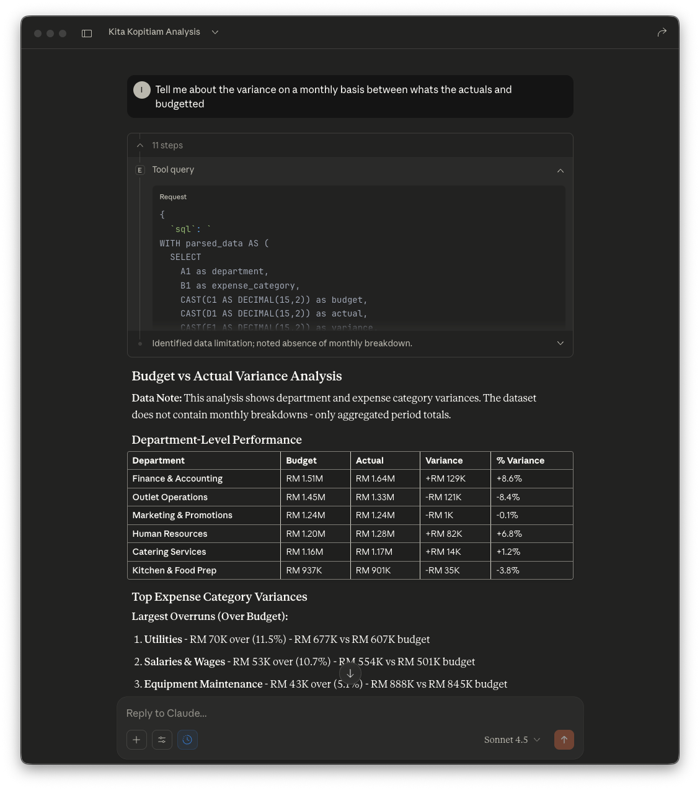

# mcp-server-excel-sql

[](https://pypi.org/project/mcp-server-excel-sql/)
[](https://opensource.org/licenses/MIT)
[](https://modelcontextprotocol.io)
[](https://github.com/ivan-loh/mcp-excel/actions)

Let Claude query your Excel and CSV files using SQL - no SQL knowledge required. Ask questions in plain English, Claude writes and executes the queries automatically.

## What It Does

**How it works:**
1. Point the server at your Excel/CSV files
2. Ask Claude questions in plain English
3. Claude writes SQL queries automatically
4. Get instant answers from your data

**Capabilities:**
- Each Excel sheet and CSV file becomes a queryable SQL table
- Join data across multiple files and formats (xlsx, xls, csv, tsv)
- Clean messy data with YAML transformation rules
- Deploy for teams with concurrent access
- Support for complex queries (aggregations, window functions, CTEs)



## Should You Use This?

**Great fit if you:**
- Work with Excel files under 100MB
- Want data insights without SQL knowledge
- Need to join multiple spreadsheets
- Use AI assistants (Claude writes the SQL for you)
- Prototype before building ETL pipelines

**Not the right tool if you:**
- Have files over 100MB (use database import instead)
- Need to modify Excel files (read-only)
- Need formulas/macros/VBA (values only)
- Building production data warehouse (prototyping only)

## Installation

**Install uv:**
```bash
curl -LsSf https://astral.sh/uv/install.sh | sh
```

That's it. No package installation needed - `uvx` runs the server on-demand.

## Try It Now

```bash
git clone https://github.com/ivan-loh/mcp-excel.git
cd mcp-excel
python examples/finance/create_finance_examples.py
uvx --from mcp-server-excel-sql mcp-excel --path examples/finance
```

## Quick Start

### Claude Desktop

Add to `~/Library/Application Support/Claude/claude_desktop_config.json`:

```json
{
  "mcpServers": {
    "excel": {
      "command": "uvx",
      "args": [
        "--from", "mcp-server-excel-sql", "mcp-excel",
        "--path", "/path/to/excel/files/"
      ]
    }
  }
}
```

Update the path and restart Claude Desktop.

### Command Line Testing

```bash
# Test with your files
uvx --from mcp-server-excel-sql mcp-excel --path /path/to/excel/files

# With auto-refresh
uvx --from mcp-server-excel-sql mcp-excel --path /path/to/files --watch
```

## Common Use Cases

- **Financial Analysis** - Budget vs actuals, AR aging, revenue trending
- **Sales Reporting** - Territory performance, product analysis, customer segmentation
- **Operations** - Inventory reconciliation, vendor comparison, project tracking
- **Data Exploration** - Quick SQL access, data quality testing, analytics prototyping

## Available Tools

- **tool_list_tables** - Lists all tables and views with file paths and row counts
- **tool_get_schema** - Shows column names and types for a table or view
- **tool_query** - Execute read-only SQL queries (joins, aggregations, CTEs)
- **tool_refresh** - Reload data after file changes (automatic with --watch)
- **tool_create_view** - Create persistent SQL views that survive restarts
- **tool_drop_view** - Delete a view and its storage

## Understanding Table Names

Tables are named: `<alias>.<filename>.<sheet>` (lowercase, sanitized)

**Example:** File `/data/sales/Q1-2024.xlsx` sheet `Summary` → `sales.q12024.summary`

**Important:** Always quote table names in SQL:
```sql
SELECT * FROM "sales.q12024.summary"  -- Correct
```

## System Views

- **`<alias>.__files`** - File inventory (paths, sheet count, rows, modification time)
- **`<alias>.__tables`** - Table catalog (names, source file, sheet, row count)

## Persistent Views

Create reusable SQL views stored on disk that automatically restore on server restart.

**Example:**
```sql
CREATE VIEW high_value_sales AS
SELECT * FROM "sales.data.summary" WHERE amount > 1000
```

Use for filtering, aggregations, or multi-table joins. Manage with `tool_create_view()`, `tool_drop_view()`, and `tool_list_tables()`.

## Data Transformation

Clean messy Excel files with YAML transformation rules:

**Capabilities:**
- Skip header/footer rows, combine multi-row headers
- Filter rows with regex or column conditions
- Rename columns, set data types (dates, decimals)
- Pivot wide to long format, specify cell ranges
- Extract tables from multi-table sheets

**Usage:**
```bash
uvx --from mcp-server-excel-sql mcp-excel --path /data --overrides config.yaml
```

See `examples/finance/finance_overrides.yaml` for complete configuration examples.

## Auto-Detection Features

Handle complex Excel files automatically without manual configuration.

**What it detects:**
- Merged cells, hidden rows/columns
- European number formats (1.234,56 → decimals)
- Multiple tables on single sheets
- Header rows, metadata rows

**Enable:**
```yaml
messy_report.xlsx:
  sheet_overrides:
    "Report":
      auto_detect: true
```

**Use for:** Merged cell headers, hidden columns, European formatting, multi-table sheets, complex layouts.

**Limitation:** .xlsx and .xlsm only. See DEVELOPMENT.md for advanced options.

## CLI Options

```bash
uvx --from mcp-server-excel-sql mcp-excel [OPTIONS]
```

**Options:**
- `--path` - Directory containing Excel files (default: current directory)
- `--overrides` - YAML configuration file for transformations
- `--watch` - Auto-refresh when files change
- `--transport` - Communication mode: `stdio`, `streamable-http`, `sse` (default: stdio)
- `--host` - Host for HTTP/SSE (default: 127.0.0.1)
- `--port` - Port for HTTP/SSE (default: 8000)
- `--require-auth` - Enable API key authentication (uses MCP_EXCEL_API_KEY env var)

## Additional Documentation

**Multi-user deployment, security, and development:**
See [DEVELOPMENT.md](DEVELOPMENT.md) for:
- Multi-user setup with authentication
- Security model and enforcement
- Architecture and design decisions
- Performance characteristics
- Testing and development workflow

**Examples:**
See [examples/README.md](examples/) for finance and CNC datasets with detailed query examples.

## License

MIT
